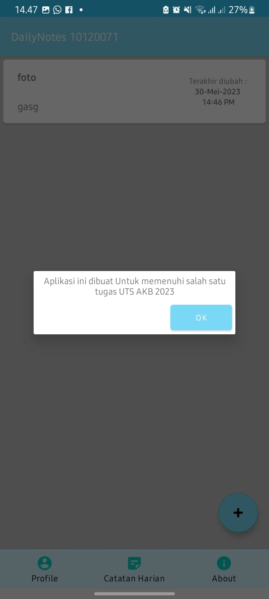

# 10120071_notes_Application

NIM   : 10120071
Nama  : Gilang Dhiya
Kelas : IF-2

Project Notes Application ini dibuat untuk memenuhi salah satu tugas mata kuliah
"Aplikasi Komputasi Bergerak" yaitu dengan membuat Aplikasi Notes  sederhana
dengan menggunakan Android Studio

#Preview

    

    

    

    

    

    

    

    

    

    

